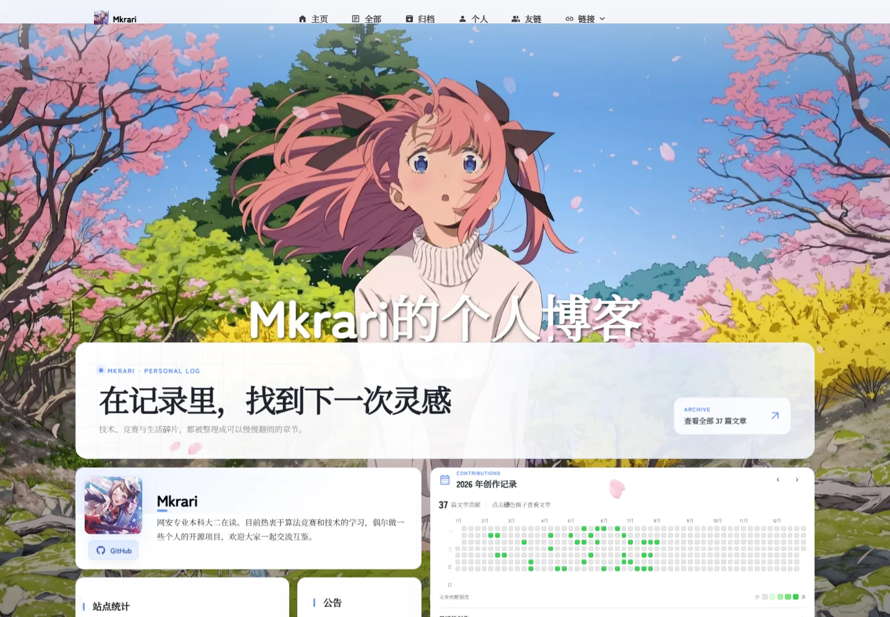

<div align="center">

# Mkrari Blog

A content-focused Astro blog with immersive visuals and lightweight static deployment.

[](https://astro.build/)
[](https://svelte.dev/)
[](./LICENSE)

[Live Site](https://mkrari.cn/) · [简体中文](./README.md) · [Get Started](#quick-start)

</div>



## Overview

Mkrari Blog is a customized static blog based on [Mizuki](https://github.com/LyraVoid/Mizuki) and [Fuwari](https://github.com/saicaca/fuwari). It keeps the immersive wallpaper, responsive cards, and rich Markdown experience while focusing on readable posts, organized archives, local search, and efficient deployment.

## Highlights

- Astro 7, Svelte 5, Tailwind CSS 3, and TypeScript
- Post directories, categories, tags, archives, and Pagefind search
- Extended Markdown, syntax highlighting, KaTeX, and Mermaid
- Light/dark themes, responsive layout, wallpapers, and table of contents
- RSS / Atom, sitemap, friend links, comments, likes, and share posters
- Optional analytics and comments; Twikoo is loaded only near the comment area
- Lazy image decoding, subsetted fonts, minified CSS, and asset caching

## Quick Start

Node.js 20+ and pnpm are recommended.

```bash
git clone https://github.com/Mkrari/Mkrari_blog.git
cd Mkrari_blog
pnpm install
pnpm dev
```

The development server is available at `http://localhost:4327/`.

```bash
pnpm run check   # Astro and type checks
pnpm build       # Static build, Pagefind index, and font subsetting
pnpm preview     # Preview the production build
pnpm new-post    # Create a post
```

## Content and Configuration

- `src/config.ts`: site metadata, navigation, profile, comments, analytics, and theme
- `src/content/posts/`: blog posts, preferably one directory per post
- `src/content/spec/`: content for special pages
- `src/data/friends.ts`: friend links
- `src/data/directory-covers.ts`: category cover images
- `public/`: assets copied directly to the final site
- `assets/fonts-source/`: build-only font sources; original files are not deployed

Example frontmatter:

```yaml
---
title: My First Post
published: 2026-01-01
description: A short summary
image: ./cover.webp
tags: [Astro, Blog]
category: Notes
draft: false
comment: true
---
```

Analytics, comments, and other third-party integrations are explicitly enabled in `src/config.ts`. The public template ships without private website IDs, endpoints, or keys.

## Deployment

Run `pnpm build` and deploy `dist/` to Vercel, Netlify, Cloudflare Pages, GitHub Pages, or any static host. Update `siteConfig.siteURL` before deployment. Recommended Vercel cache headers are included in `vercel.json`.

## Credits and License

This project is derived from [Mizuki](https://github.com/LyraVoid/Mizuki), which is based on [Fuwari](https://github.com/saicaca/fuwari), and is powered by [Astro](https://github.com/withastro/astro). Keep both `LICENSE` and `LICENSE.MIT`, and follow the licenses of the upstream projects and bundled assets.
